# `git`: command line usage demonstration/practical.

This session is designed to work in a terminal/console. Please ensure that you have git properly [installed](https://git-scm.com/book/en/v2/Getting-Started-Installing-Git).

A detailed [reference book](https://git-scm.com/book/en/v2).

Let's use [Git Command Line Cheat Sheet PDF](https://www.jrebel.com/system/files/git-cheat-sheet.pdf) provided by [JRebel](https://www.jrebel.com/blog/git-cheat-sheet).


## Single repository

### Create a working directory for a project

Let's create a new directory `my_project` for a project.  
This is the working directory in which the files and subdirectories of the project are going to be developed (edited).  

Shell commands used here:

- `mkdir`: Make a new local directory (called `my_project`).
- `cd`: Change the current directory to the newly created directory.
- `pwd`: Show the full system path to the current directory. Is it `my_project`?
- `ls`: List the content of the current directory. It should be empty. Is it empty?
- `ls -ltra`: List the content of the current directory one entry per line, with details.

```sh
mkdir my_project
cd my_project
pwd
ls
ls -ltra
```


### Create a text file in the working directory

Let's create a file `a.txt` with a few text lines.  
This file is the first file of the project.

New shell commands used here:

- `echo >file.txt "some text"`: Creates a new file `file.txt` and writes "some text" to it.
- `echo >>file.txt "next line text"`: Appends to file `file.txt` a new line with "next line text" content.
- `cat file.txt`: Show the file `file.txt`.

```sh
echo >a.txt "First line"
echo >>a.txt "Second line"
echo >>a.txt "Third line"
cat a.txt
ls -ltra
```

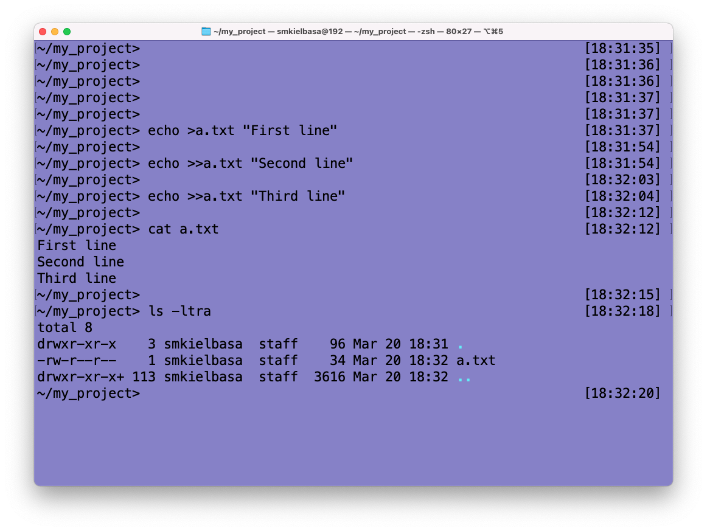

### Initialize empty, local git repository in the project directory

So far there is no git repository for the project so let's create it.  
The git repository will allow to store future versions of *selected files* from the project working directory (and its nested subdirectories).  
After creation the repository is still empty - files will need to be added and committed.

The git repository is stored in a hidden subdirectory of the project working directory (called `.git`).  

New shell commands used here:

- `git init .`: Initializes a new git repository. The current directory  becomes the top level directory of the repository.

```sh
ls -ltra          # before creating the repository
git init .
ls -ltra          # new dir .git after creating
pwd
```

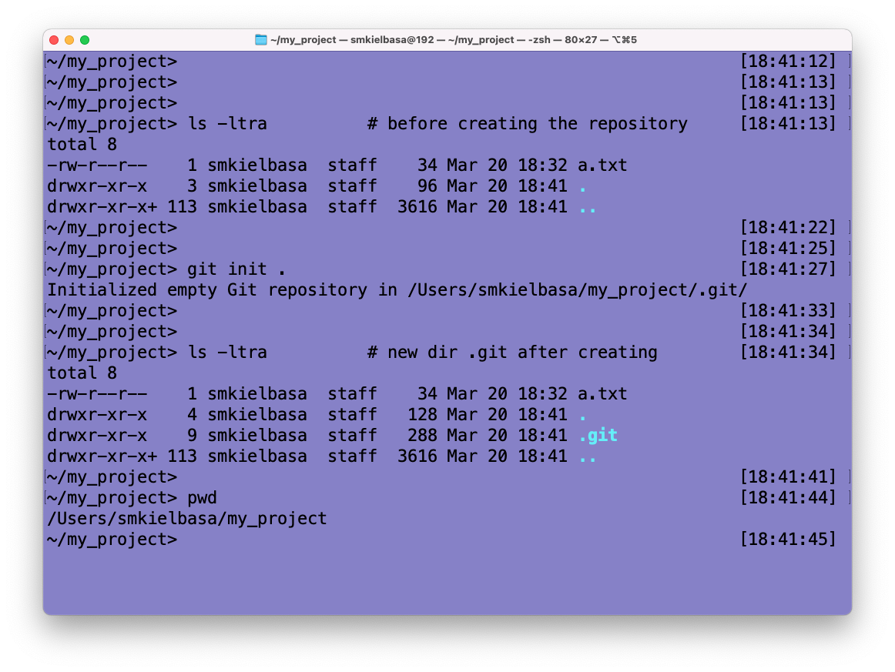

### Add the new file(s) and commit them to the local git repository

Git does not store file content and their changes automatically (in the background). The user decides when to store current file contents.  

This action is performed in two steps using the following shell commands:

- `git add [file.txt]` :   
  This command declares that *the current* content of the file `file.txt` is intended to be stored in the repository.  
  At this moment the content of `file.txt` gets copied to a git-internal, local, temporary *staging dir* - but the file is not stored in the repository yet.  
  You may call `git add` several times to prepare multiple files to be added to the repository.

- `git commit -m "A description of changes."` :  
  This command takes all the changes from the staging dir and writes them to the repository.  
  The message is obligatory and it should provide a short description of what has changed in the files.  
  In the future these messages allow easier identification when a searched modification happened.

Additional shell commands used here:

- `git status` :  
  Shows which files in the working directory are new or changed.
- `git log` :  
  Shows history (of yet non-existing) repository changes. The many options specify the style of printing.  
  Sometimes, you may need to press `Q` to exit this command.

```sh
git status
git add a.txt
git status
git commit -m "First version"
git status
git --no-pager log --all --decorate --oneline --graph
```

The screenshot below shows that:
- The repository uses now the `master` (or `main`) branch.
- So far there is only one commit, here denoted `715eab4`, with the comment: `First version`).
- The current repository reference commit (`HEAD`) is at the commit `715eab4`.

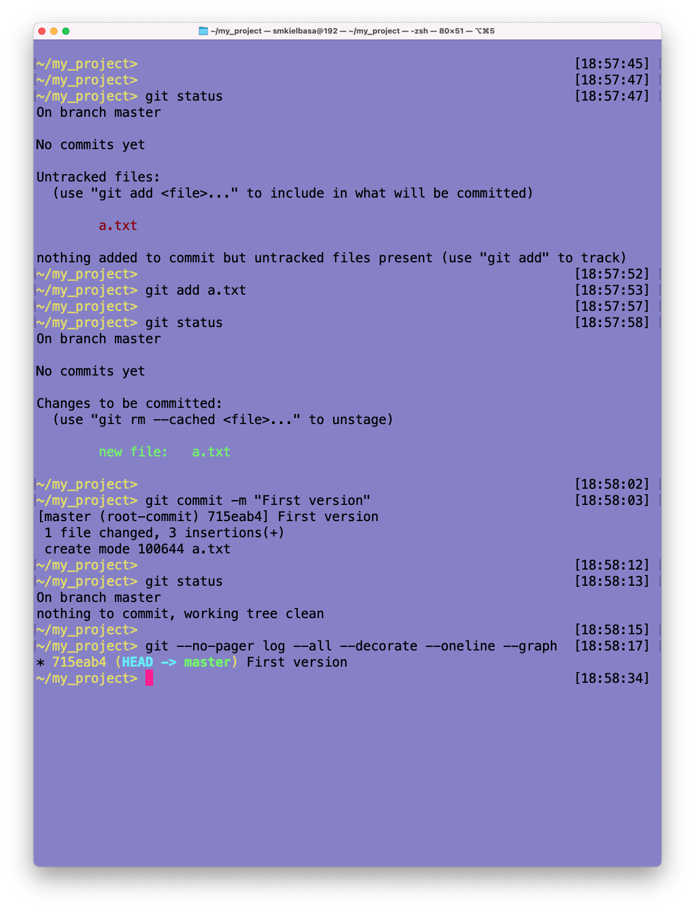

### Modify a file in the working directory

Let's modify the `a.txt` (fully rewritten in this example) and show its differences with respect to the recent repository version.

Additional shell command used here:

- `git diff` :  
  Allows to show the differences between the current version of a file in the working directory and the latest version of the file kept in the repository.  
  Sometimes, you may need to press `Q` to exit this command.


```sh
echo >a.txt "First line"
echo >>a.txt "Third line"
echo >>a.txt "Last line"
cat a.txt
ls -ltra
git --no-pager diff
```

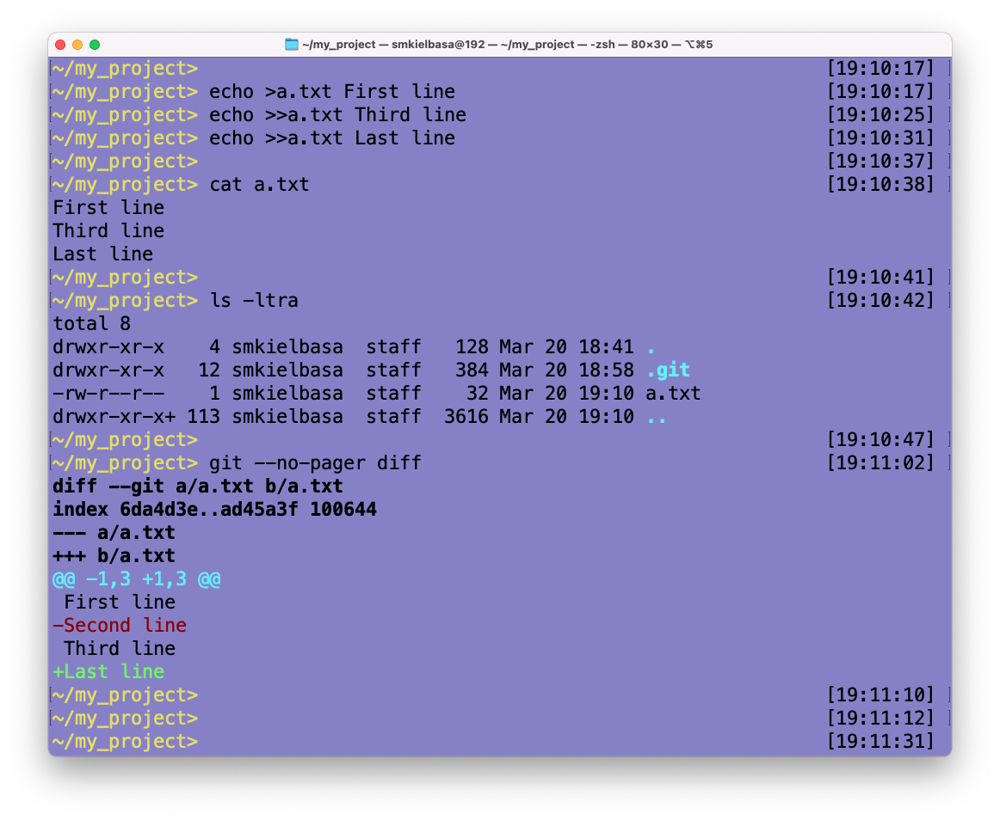


### Add the modified file(s) and commit them to the local git repository

Let's assume that the modifications of the files in the working directory reached the next state worth snapshotting.  
Consequently, the add/commit cycle needs to be repeated.

```sh
git add a.txt
git commit -m "Modified content"
git --no-pager log --all --decorate --oneline --graph
```

The screenshot below shows that:
- The repository uses now the `master` (or `main`) branch.
- There are two commits: currrent `a9b42145` and the earlier `715eab4`. - The current repository reference commit (`HEAD`) is at the commit `a9b42145`.

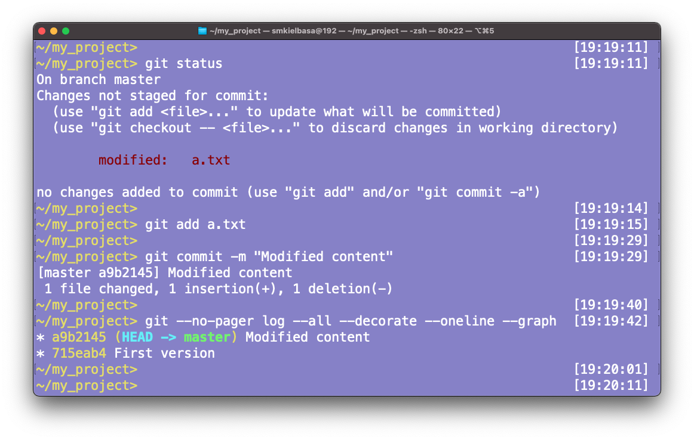

### Create a file in a subdirectory of the working directory

To demonstrate how to work with subdirectories, let's create the `b.txt` in a subdirectory 'subdir'.  

```sh
mkdir subdir
echo >subdir/b.txt "Line 1"
echo >>subdir/b.txt "Line 2"
cat subdir/b.txt
ls -ltra
ls -ltra subdir
```

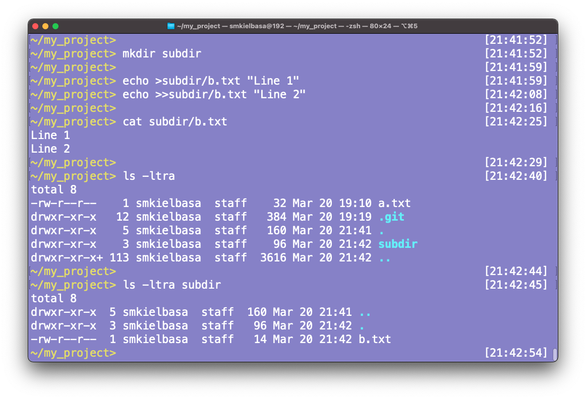

### Add the modified subdirectory file(s) and commit them to the local git repository

Let's add the all files from the subdirectory `subdir` to the repository.  
*Note:* Git tracks files, not subdirectories. You can't add an empty subdirectory to the git repository.

```sh
git status
git add subdir/*
git status
git commit -m "Added subdirectory"
git status
git --no-pager log --all --decorate --oneline --graph
```

The screenshot below shows that:
- There are 3 commits now.

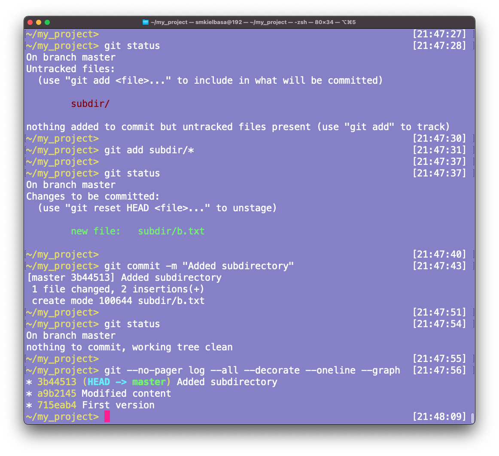

## Two repositories: the origin and a clone

### Note location of the primary repository

So far we used one repository. Let's note its location/directory.  
In the next sections replace `[primary_git_dir]` with the noted location.  
*Note:* The screenshots with approx. **blue background** are executed in the directory of the primary repository.

```sh
pwd
```


### Clone the primary repository in another location

Let's say that we want to develop the project further in another directory location (it could be on another machine but now let's stay on the same computer).  
Let's  go out of the primary repository directory and then clone the repository into a new directory called `my_project_cloned`.  

*Note:* **Start another console/terminal.** The screenshots with approx. **red background** will be executed in the directory of the cloned repository.

```sh
#cd       # change directory somewhere outside the primary repository
git clone [primary_git_dir] my_project_cloned
cd my_project_cloned
```

Note the location of the cloned git repository. Below it will be denoted `[cloned_git_dir]`:

```sh
pwd
```

Now, in the `my_project_cloned` directory you will have:
- Files of the latest committed version of the project.
- A *full own copy* of the repository (so full copy of the history-so-far taken from `my_project/.git` and kept in `my_project_cloned/.git` hidden subdirectory).

The cloned repository remembers its `origin` (where it was cloned from).  
You may see it with the following command:

```sh
git remote -v
```

Cloning does not change the primary repository, so the primary repository does not remember that it has been cloned.

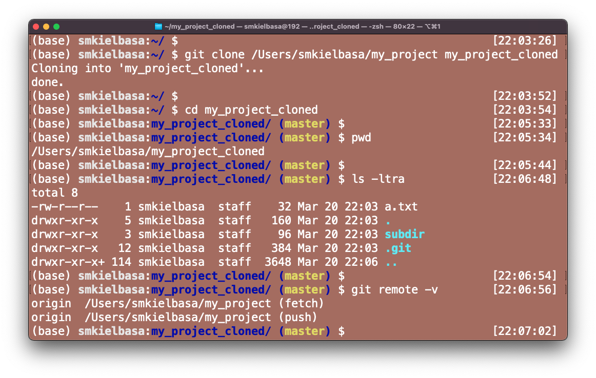

### Introduce a change in the cloned repository

Let's create a new file `c.txt` in the cloned working directory, add it to the staging area of the cloned repository and then commit.

```sh
#cd [cloned_git_dir]
echo >c.txt "Another line 1"
git add c.txt
git commit -m "New file in cloned repository"
git --no-pager log --all --decorate --oneline --graph
```

The screenshot below shows that:
- There are 4 commits now in the cloned repository.

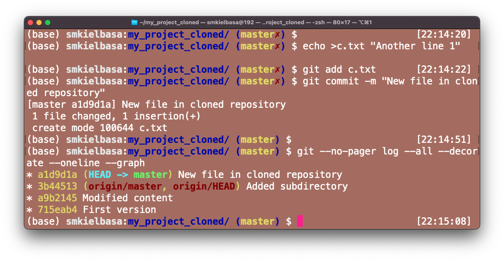

### Observe different states of the cloned and the primary repositories

The primary and cloned repositories are fully independent.  
They is **no automatic synchronization** between repositories.

```sh
#cd [primary_git_dir]
git --no-pager log --all --decorate --oneline --graph
```

The screenshot below shows that:
- In the primary repository there are still only 3 commits.


### Pull changes from the cloned repository to the main repository

Pulling operation involves two repositories: *local* and *remote* .  
The *local* is the repository corresponding to the directory in which the command is executed.  
The contents of the *remote* repository are downloaded into the *local* repository.  
In the *local* working directory the changes obtained from the *remote* are **merged** .  
The *remote* repository is not changed.

```sh
#cd [primary_git_dir]
git --no-pager log --all --decorate --oneline --graph
git pull /Users/smkielbasa/my_project_cloned
git --no-pager log --all --decorate --oneline --graph
```

The screenshot below shows that:
- First, in the primary repository there are only 3 commits.
- The `pull` operation downloads the `c.txt` file.
- At the end there are 4 commits in the primary repository.

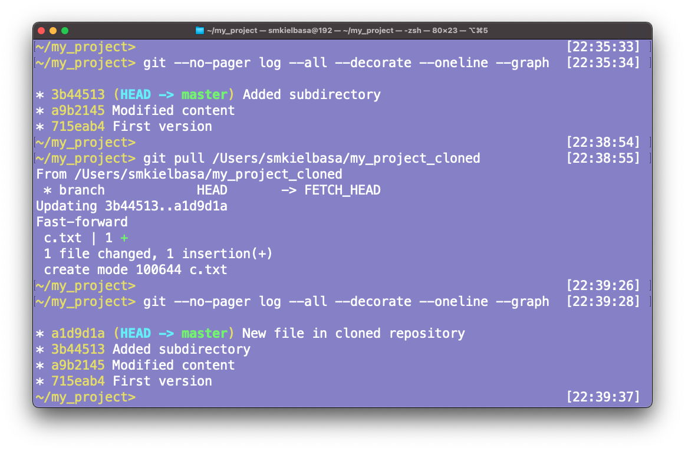

### Pushing changes

Pushing operation is the opposite of pulling.  
It is not possible to push to repositories containing a working directory but it is used to push changes to repositories kept on other servers.

### Conflict demonstration: changing the same file in two repositories

Let's introduce two different changes of the ends of the `c.txt` files of both repositories.

In the primary repository:

```sh
#cd [primary_git_dir]
cat c.txt
echo >>c.txt "Another line 2"
cat c.txt
git add c.txt
git commit -m "This is the line 2"
git --no-pager log --all --decorate --oneline --graph
```

And in the cloned repository:

```sh
#cd [cloned_git_dir]
cat c.txt
echo >>c.txt "Another line TWO"
cat c.txt
git add c.txt
git commit -m "This is the line TWO"
git --no-pager log --all --decorate --oneline --graph
```

The screenshots below show that:

- Both repositories have the same commits from `715eab4` to `a1d9d1a`.
- After `a1d9d1a` the changes diverge to two different states.

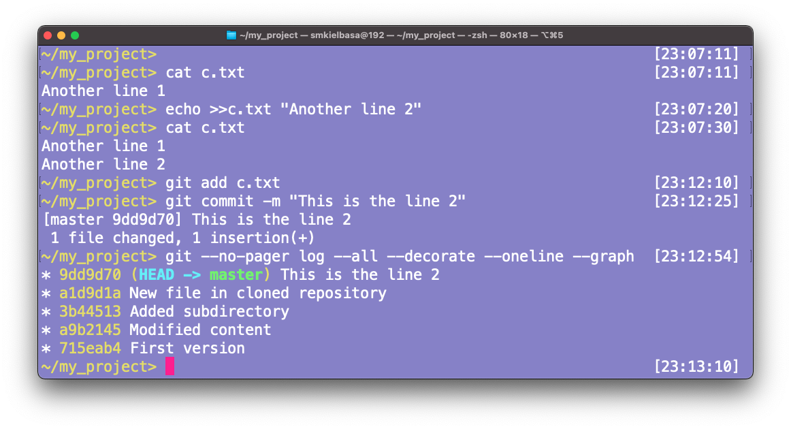

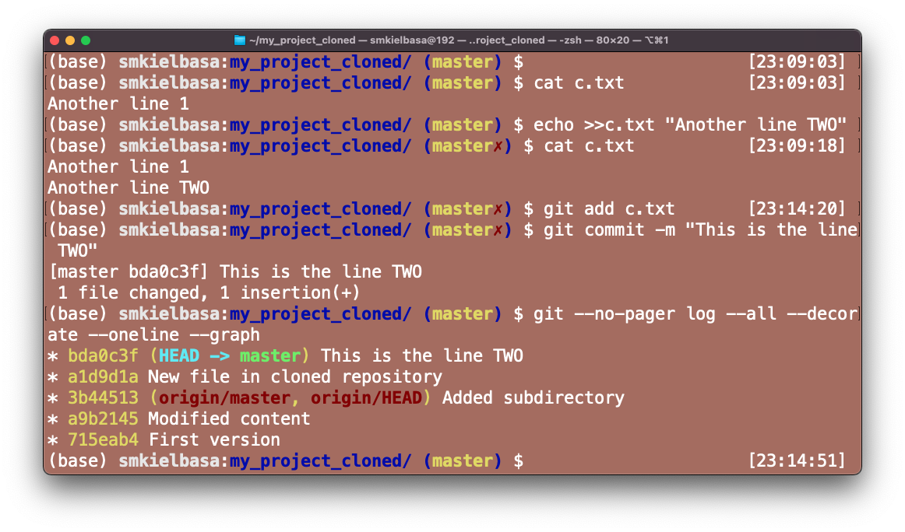

### Conflict demonstration: pulling leads to a failing merge

Let's repeat the pull step: to the primary repository we want to pull changes committed to cloned repository.  
Overall the process fails:
- Fetching the data from the cloned repository to the primary repository is successful.
- Automatic merging of both contents of the file `c.txt` fails and produces in the working directory a version of `c.txt` which needs to be manually corrected.

```sh
#cd [primary_git_dir]
git pull /Users/smkielbasa/my_project_cloned
git status
```

Observe the conflict messages:

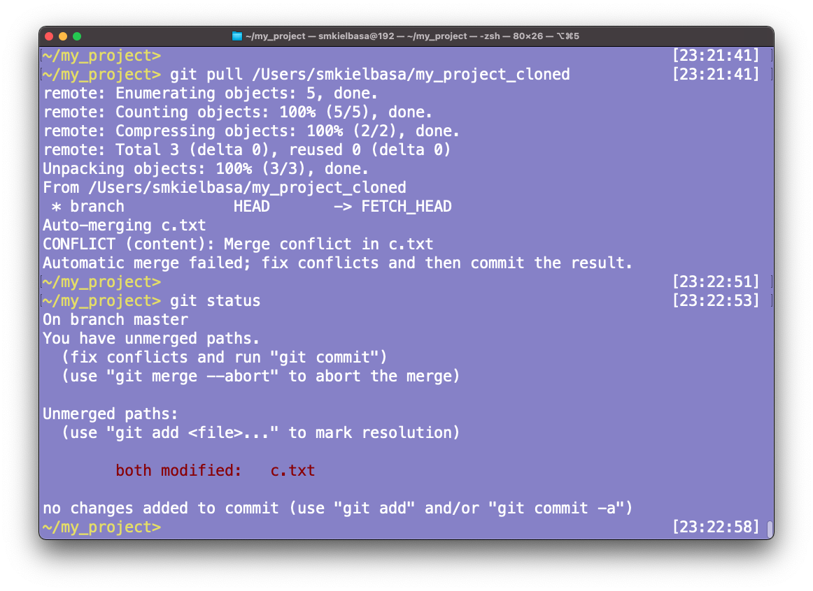

### Conflict demonstration: manual conflict resolution

The pulling was executed in the primary working directory, so let's check there for the content of the `c.txt` file after the failed merge.

```sh
#cd [primary_git_dir]
cat c.txt
```

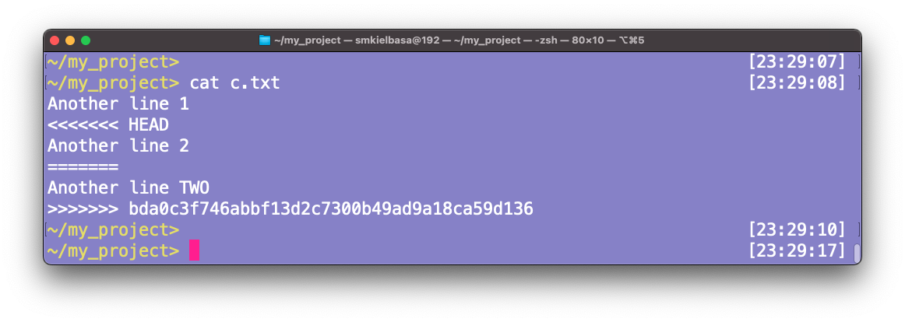

Conflicting lines are surrounded by smaller/greater signs.  
The file needs to be manually corrected in a text editor.  
The markings (`<<<<<<<` `=======` `>>>>>>>`) need to be removed.  
For example, let this be the corrected `c.txt` content:


### Conflict demonstration: committing resolved conflict

Once the file with conflict is corrected the standard add/commit process is used to finalise the process.

```sh
git add c.text
git status
git commit -m "Conflict resolved"
git --no-pager log --all --decorate --oneline --graph
```

Observe the log of the changes and how the branching/merging is visualised:

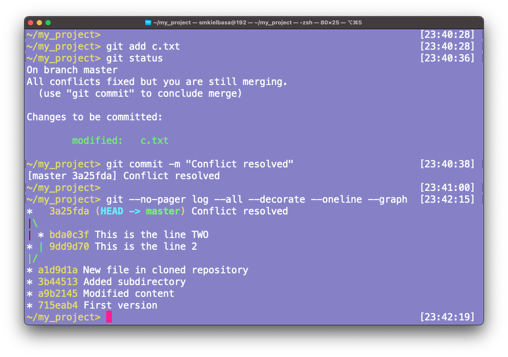

## How does git work

### Hashing files

For this demonstration to work, be sure that the `c.txt` file is committed and not modified in the working directory (so, `git status` does not report it to be modifed).

File hashing is a method which for a given single file calculates a fixed length string (the hash) with the following properties:
- Files with identical content always give the same hash.
- Any small change of the file should strongly change the hash.
- The calcualtion is fast.
- It should be difficult to find a different file with the same hash.

Let's calculate the `git` hash for the `c.txt` file:

```sh
git status
git hash-object c.txt
```

Observe, the hash for the current content of `c.txt` file is `6f816157025d9d386164116dd17780c5d97aefcf`.


### Key-value store (file example, `blob`)

Git is a key-value database. The key is the file hash. The value is the content of the file.  
Conceptually, the database is implemented by the filesystem. The data are stored in the `.git/objects` directory.

Let's find where the content of the file represented by the `6f816157025d9d386164116dd17780c5d97aefcf` is stored.  
To print the content of a file corresponding to a particular hash `git cat-file -p` command can be used.

```sh
ls .git/objects
ls .git/objects/6f
git cat-file -p 6f816157025d9d386164116dd17780c5d97aefcf
cat c.txt
```

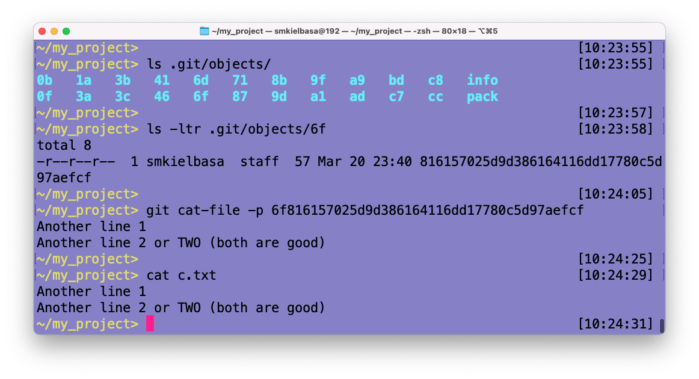

### Key-value store (commit example, `parent`)

The information about commits is also stored in the key-value database.  
A file describing a commit is prepared, hashed and stored.  
The calculated hash is used to identify commits.  
You can use the first digits of a hash, as long as they are sufficient to identify a single commit.

Let's find the internal commit description file for the commit `3a25fda`:

```sh
git --no-pager log --all --decorate --oneline --graph
git cat-file -p 3a25fda
```

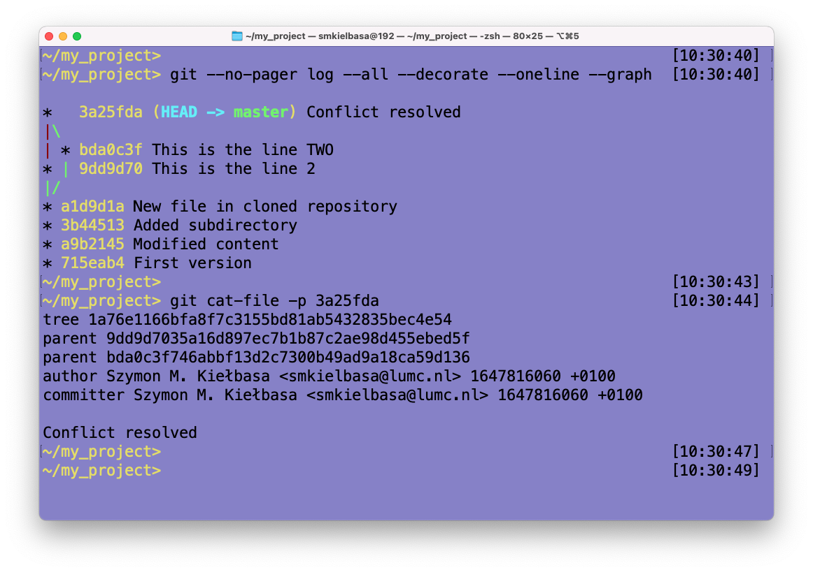

### Key-value store (directory example, `tree`)

Finally, let's see how directory information is maintained:

```sh
git cat-file -p 1a76e1166bfa8f7c3155bd81ab5432835bec4e54
```


